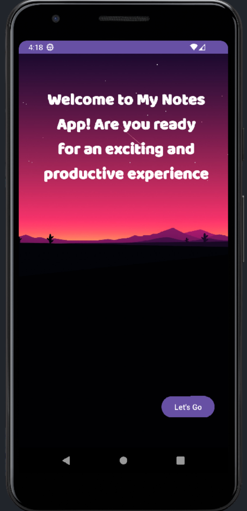
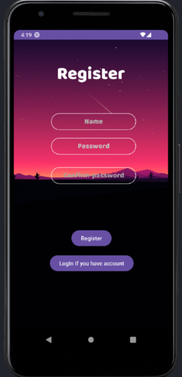
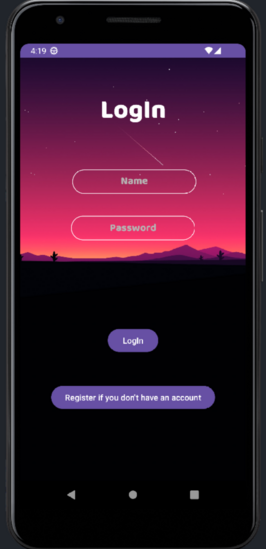
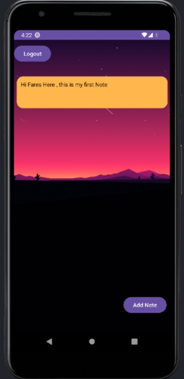
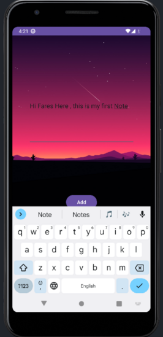
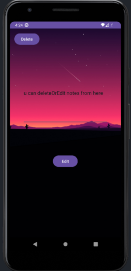

# MyNotesApp

Welcome to MyNotesApp, a simple mobile app that allows users to register, log in, and take notes. This app utilizes a serializable file as a database to store user information and their notes.

## Features

- **User Registration:** New users can create an account by providing a unique username and a password.

- **User Login:** Registered users can log in to their accounts using their username and password.

- **Note Taking:** Once logged in, users can create, edit, and delete their notes.

- **Serializable Database:** The app uses a serializable file as a database to store user information and notes locally.

## Getting Started

Follow these steps to set up and run the app on your local machine:

1. **Clone the Repository:**
2. git clone https://github.com/Fares-Nawi/MyNotesApp.git
3. **Navigate to the Project Directory:**
4. cd MyNotesApp
5. **Build and Run:**
Open the project in your preferred development environment (e.g., Android Studio), build the app, and run it on an Android emulator or a physical device.

## Screenshots

## Dependencies

This app relies on the following libraries and components:

- Android SDK
- Serializable file handling for local data storage

## Contributing

Contributions are welcome! If you find any issues or have suggestions for improvements, feel free to open an issue or submit a pull request.

